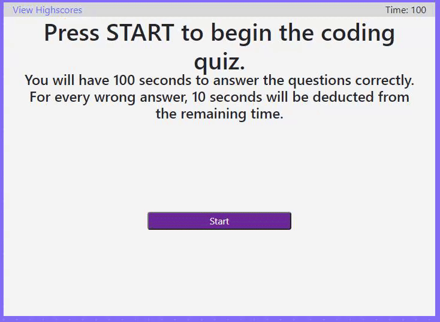
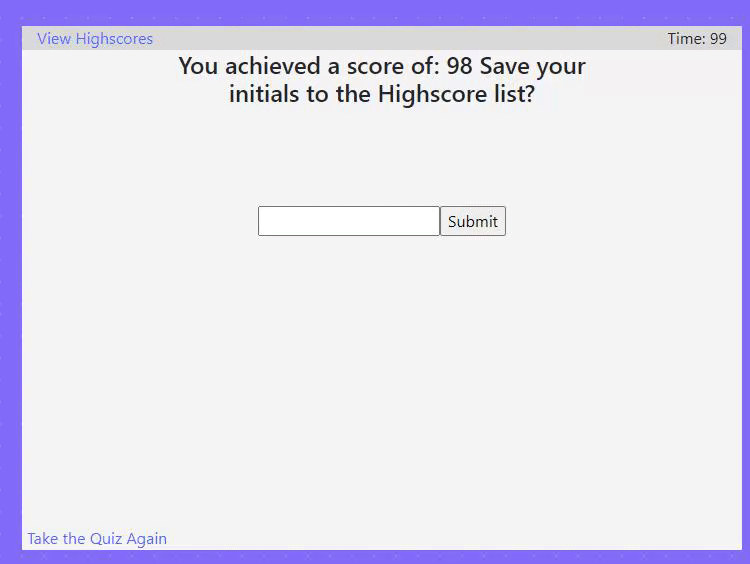

# Coding Quiz: JavaScript

## Functionality
This program runs on two script files. One for the main Quiz, and the other for the highscores page.
I recieved no assistance and all of the work seen here is my own. The main script focuses on dynamically building
the HTML for the quiz, adding and removing elements as necessary. Using a combination of bootstrap and css for visuals, and jquery for easy HTML 
creation and alteration, this is my largest JS project by far. I am glad it all came together.

## Files
* Assets
    * css-dot-pattern-grid-background.png
    * highscores.gif
    * quiz.gif
* index.html
* highscores.html
* script.js
* script2.js
* style.css
* README.md

## Visual Aid
Speed Quiz

Checking and Clearing Highscores

Created by James Totah
Live Deployed app found [Here](https://jtwob.github.io/Coding_Quiz/)